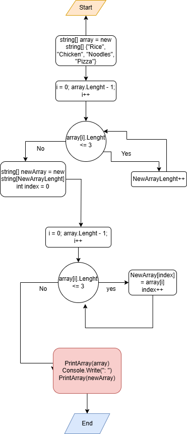

## _Итоговая работа за первый блок, выполнена Марией Ханок_!!!
 #### _Задание было таковым_:

 1. Создать репозиторий на GitHub
2. Нарисовать блок-схему алгоритма (можно обойтись блок-схемой основной содержательной части, если вы выделяете её в отдельный метод)
3. Снабдить репозиторий оформленным текстовым описанием решения (файл README.md)
4. Написать программу, решающую поставленную задачу
5. Использовать контроль версий в работе над этим небольшим проектом (не должно быть так, что всё залито одним коммитом, как минимум этапы 2, 3, и 4 должны быть расположены в разных коммитах)

* Задача: Написать программу, которая из имеющегося массива строк формирует новый массив из строк, длина которых меньше, либо равна 3 символам. Первоначальный массив можно ввести с клавиатуры, либо задать на старте выполнения алгоритма. При решении не рекомендуется пользоваться коллекциями, лучше обойтись исключительно массивами.

Примеры:
[“Hello”, “2”, “world”, “:-)”] → [“2”, “:-)”]
[“1234”, “1567”, “-2”, “computer science”] → [“-2”]
[“Russia”, “Denmark”, “Kazan”] → []

 _После создания репозитория, я приступила к написанию блок-схемы, однако пример я решила привести не непосредственно из задания, а свой собственный, ибо ~~была голодная~~ хотела проявить фантазию и показать этузиазм к работе. Блок-схема выглядит так_:

После этого, я приложила руки к написанию этого файла. По течению работы я еще буду его обновлять.

Я хотела не париться и в качестве примеров взять те, которые указаны в задании, но надеюсь, что использовать свои не будет запрещено. 
### В итоге мои 3 примера для дальнейшего использования выглядят таким образом. Лично для меня они очень полезные, жизненные и приятные глазу:

1. [“Rice”, “Chicken”, “Noodles”, “Pizza”]
2. [“Поспать”, “Полежать”, “Посидеть”, “Попердеть”] 
3. [“Тут”, “Три”, “Слова”]

#### Далее, я написала с потом и кровью код, увидеть его можно в Program.cs на ветке main. 

###### _С первого раза код удался, но всегда выдавал 0 значений из списка и работал так, как будто это был просто селектор задачки по душе. В конце концоа я вспомнила, что забыла написать вывод, хотя про ввод моя плавленая голова не забыла._ 

#### Дописав код, я решила проверить гит лог и сделанные мной коммиты, чтобы убедиться, что их достаточно.

* #### Сделала я итоговую не совсем рано, но вполне в срок. Это было нелегко, но в любом случае мне очень понравился процесс и мне достаточно комфортен язык C#!

## Надеюсь, программирование для меня останется таким же интересным и увлекательным. Огромное спасибо за основу, которую вы дали мне на первом блоке!! 